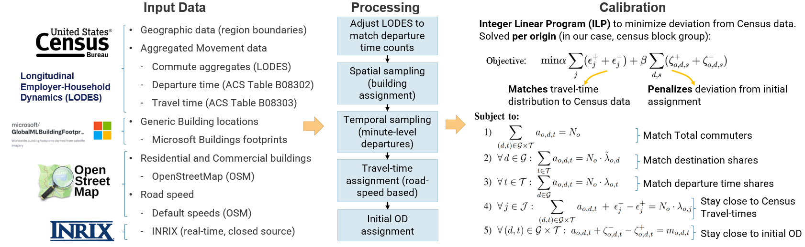
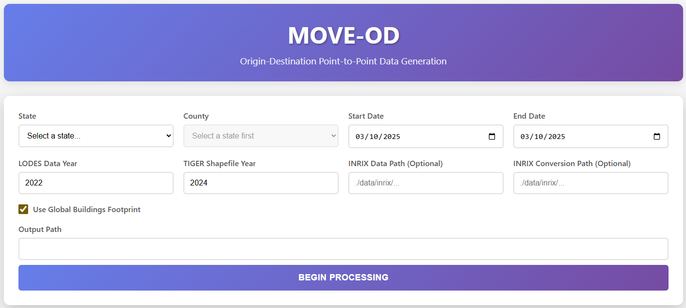
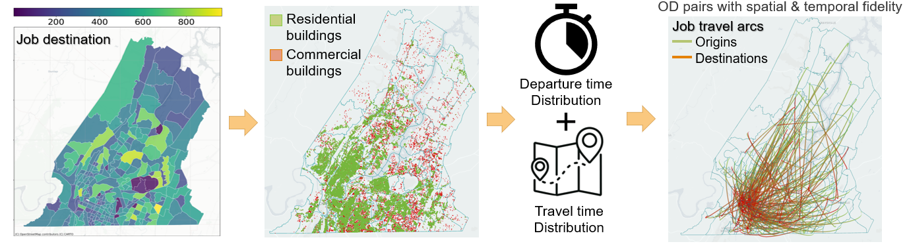

<!-- README: user-focused web app guide. Short, practical, avoids backend/API internals. -->

**MoveOD: Synthesizing Origin-Destination Commute Distribution from U.S. Census Data**

[](https://python.org)
[](https://fastapi.tiangolo.com)
[](LICENSE)

<!-- ---

## 📖 Table of Contents

- [Overview](#overview)
- [Quick Start](#quick-start)
- [Architecture](#architecture)
- [Features](#features)
- [Documentation](#documentation)
- [Installation](#installation)
- [Usage](#usage)
- [API Reference](#api-reference)
- [Deployment](#deployment)
- [Migration from Streamlit](#migration-from-streamlit)
- [Troubleshooting](#troubleshooting)
- [Contributing](#contributing) -->

<!-- --- -->

## Overview

MOVE-OD is a comprehensive transportation data generation system that creates calibrated origin-destination (OD) trip data for transportation analysis.

You can access the full paper here: [ArXiV](https://arxiv.org/abs/2510.18858)

### What It Does

1. **Processes LODES Data** - Employment data from LEHD Origin-Destination Employment Statistics
2. **Integrates Building Footprints** - Microsoft Global Buildings and OpenStreetMap data
3. **Performs Routing** - Uses INRIX traffic data or OSM for travel time calculations
4. **Calibrates with ILP** - Integer Linear Programming for census-accurate trip generation
5. **Generates OD Trips** - Complete origin-destination trip tables with timing

<p align="center">
  
</p>

## Quickstart

### 1. Configure Census API Key

Move-OD requires a free Census API key to download LODES and geographic data.

1. Get your free API key from: [Census API Key Signup](https://api.census.gov/data/key_signup.html)
2. Copy the config template:
   ```bash
   cp .env.example .env
   ```
3. Edit `.env` and replace `YOUR_CENSUS_API_KEY_HERE` with your actual key

### 2. Install Dependencies

```bash
cd move_od
pip install -r requirements.txt
pip install -r backend/requirements.txt
```

### 3. Start the Application

**Option A: Using Streamlit (provides step by step tracking) (recommended)**

```bash
streamlit run app.py
```

**Option B: Using startup script**

```bash
./start_webapp.sh  # Linux/Mac
# or
start_webapp.bat   # Windows
```

<!--
**Option C: Manual start**

```bash
# Terminal 1: Backend
cd backend && python app.py

# Terminal 2: Frontend
cd frontend && python -m http.server 8080
``` -->

---

## Using the web app — concise steps

1. Select the State and County you want to generate OD data for.
2. Choose the available data sources for the region (Microsoft buildings provides building location without any tags).
3. (Optional) Supply auxiliary inputs if available (e.g., INRIX speeds or local files) using the UI controls.
4. Choose a date (or range). This parameter is useful when using real time road speeds like INRIX.
5. Click the "Begin processing" button to start.
6. Monitor progress in the UI. When finished, download results from the Output section or open the output folder.

<p align="center">
  
</p>

Typical runtime: small regions/minimal options ~20 minutes; larger regions ~ 120 minutes.

## Output location & format

- Default output folder: `move_OD`.
- Files are exported as Parquet for compact, fast reads.
- Typical columns:
  - origin/destination GEOIDs (origin_geocode, destiantion_geocode)
  - sampled coordinates (home_loc_lat, home_loc_lon, work_loc_lat, work_loc_lon)
  - departure_time
  - estimated time to travel to work

---

### 3. Access the Application

Open your browser to: **http://localhost:8080**

API Documentation: **http://localhost:8000/docs**

<!-- ---

## Architecture

```
┌─────────────┐
│   Browser   │
│  Port 8080  │
└──────┬──────┘
       │
       │ HTTP/AJAX
       │
   ┌───┴────┐
   │        │
   ▼        ▼
┌──────┐ ┌──────┐
│Front-│ │Back- │
│ end  │◄┤ end  │
│(HTML)│ │(API) │
└──────┘ └───┬──┘
             │
        ┌────┼────┐
        ▼    ▼    ▼
     [Data][Jobs][Process]
``` -->

<!-- 3. Open the UI in your browser (Streamlit will show the local URL, usually http://localhost:8501). -->

<!-- If you want a quick preview of a Parquet file in Python:

```python
import pandas as pd
df = pd.read_parquet('generated_OD/sample.parquet')
print(df.head()) -->

## Citation

If you use Move-OD for academic work or reports, please cite the project. Replace placeholders with final paper details if available.

BibTeX example:

```bibtex
@misc{sen2025moveodsynthesizingorigindestinationcommute,
      title={MoveOD: Synthesizing Origin-Destination Commute Distribution from U.S. Census Data},
      author={Rishav Sen and Abhishek Dubey and Ayan Mukhopadhyay and Samitha Samaranayake and Aron Laszka},
      year={2025},
      eprint={2510.18858},
      archivePrefix={arXiv},
      primaryClass={cs.CY},
      url={https://arxiv.org/abs/2510.18858},
}
```

<!--
## Troubleshooting (UI-focused)

- If the UI fails to start, check your Python environment and installed packages.
- If a job stalls, try a smaller sample size or check the output/temporary folder used by the web app.
- For data-specific problems (missing shapefiles, missing LODES/SafeGraph files), place the required files where the UI expects them or follow the prompts in the app. -->
<!--
## Contributing (brief)

Small, focused improvements are welcome. Open a GitHub issue to discuss larger changes first. For UI changes, update the Streamlit app files and add small tests or examples where appropriate. -->

## Pipeline

<p align="center">
  
</p>

## License

MIT — see the `LICENSE` file.

---
