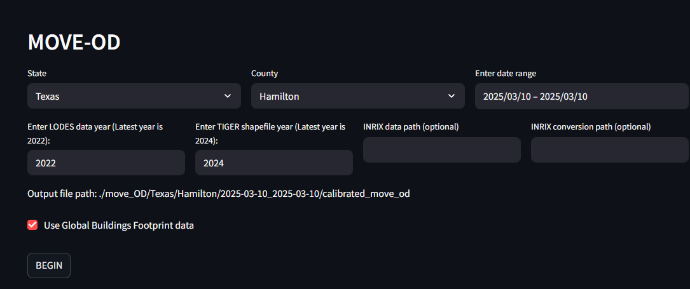

<!-- README: user-focused web app guide. Short, practical, avoids backend/API internals. -->

## Requirements

- Python 3.12 (Linux)
- Please get your US Census API key (free): https://api.census.gov/data/key_signup.html

## Setup

### 1. Configure Census API Key

Move-OD requires a free Census API key to download LODES and geographic data.

1. Once you get your free US Census API key from: [Census API Key Signup](https://api.census.gov/data/key_signup.html), copy the env template:
   ```bash
   cd move_od
   cp .env.example .env
   ```
2. Edit `.env` and replace `YOUR_CENSUS_API_KEY_HERE` with your actual key

### 2. Install Dependencies

```bash
pip install -r requirements.txt
```

### 3. Start the Application

**Using Streamlit**

```bash
streamlit run app.py
```

## Reproducibility Outcomes

- **F1**: Figure 1 (Departure time calibration vs ACS) — generated by scripts/figures_from_output.py or analysis/figures_1_2.ipynb.
- **F2**: Figure 2 (Travel time distributions: Initial, Calibrated, ACS) — generated by scripts/figures_from_output.py or analysis/figures_1_2.ipynb.

## Notes on Variability

The pipeline samples road speeds and, when INRIX (a closed-source dataset) is not used, the raod speeds falls back to default (OpenSreetMaps) speeds. As a result, figures are expected to be **qualitatively similar** but not identical to the paper.

## Step-by-Step

1. Click on the url and in the UI, You will see the following page:
   

2. Set State=“Tennessee”, County=“Hamilton” (set by default) and click **BEGIN** the pipeline.

3. Once the run finishes (potentially up to 2 hours, as the code is executed as a single process to ensure repeatability and eliminate intermediate‑state errors), run:

   `python3 figures_from_output.py --state Tennessee --county Hamilton`

4. Outputs are saved to plots/figures:
   - fig1_departure_time_calibration.png
   - fig2_travel_time_distribution.png
   - supp_od_map.png
   - supp_departure_time_hist.png

## Scenario Variations

- Use a different county/state (any supported by LODES/OSM) with the same steps.
- Provide INRIX paths in the UI to use proprietary speed data (if available).

## External Data Links (Anonymized)

- Census data: https://api.census.gov/data/key_signup.html
- (Optional) INRIX data: **not redistributed**. If available, provide the link in your local instructions.

## License

MIT — see the `LICENSE` file.

---
